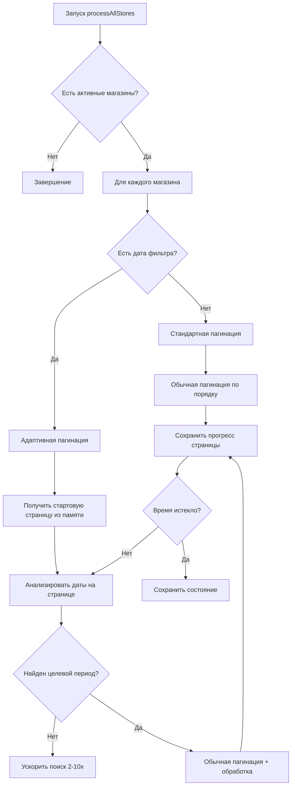

# 🤖 MP Review - Marketplace Review Management System

> Автоматизированная система управления отзывами для маркетплейсов Wildberries и Ozon

**🔥 ОБНОВЛЕННАЯ ВЕРСИЯ с Оптимизированным WB API и Улучшениями Ozon!**

Автоматизированная система для обработки отзывов на **Wildberries** (простой подход) и **Ozon** (с продвинутой пагинацией и системой памяти).

## 🎯 **ВОЗМОЖНОСТИ СИСТЕМЫ**

### ✅ **Основной функционал**
- **Автоматическое получение отзывов** из WB и Ozon API
- **Интеллектуальная отправка ответов** на основе шаблонов
- **Полная пагинация \"до победного\"** - получение всех доступных отзывов
- **Сортировка по дате** (новые отзывы первыми)
- **Фильтрация по рейтингу** (4-5 звезд) и содержанию
- **Реальные названия товаров** через Product API интеграцию

### 🚀 **Расширенные возможности**
- **🆕 Система памяти страниц (только Ozon)** - продолжение обработки с места остановки
- **🆕 Адаптивная пагинация (только Ozon)** - до 10x ускорение поиска старых отзывов
- **Оптимизированный WB API** - простой и эффективный подход
- **Управление множеством магазинов** через единый интерфейс
- **Гибкие настройки фильтрации** по датам и рейтингам
- **Режим разработчика** для безопасного тестирования
- **Автоматические триггеры** для регулярной обработки
- **Детальное логирование** всех операций

### 🛠 **Технические особенности**

**API Интеграции:**
- **Wildberries API**: Простой запрос с take=1000 + Content API
- **Ozon API**: Продвинутая пагинация last_id + Product API
- **Пакетная обработка**: до 100 товаров за запрос
- **Rate limiting**: соблюдение лимитов API
- **Error handling**: graceful fallback при сбоях

**Google Apps Script:**
- **Google Sheets** как основное хранилище
- **HTML sidebar** для управления магазинами  
- **Триггеры** для автоматизации
- **Properties Service** для конфигурации

## 📋 **СОДЕРЖАНИЕ**

1. [📦 Установка](#-установка)
2. [🔧 Конфигурация API](#-конфигурация-api)
3. [🔥 Новые функции](#-новые-функции)
4. [🧠 Система памяти страниц](#-система-памяти-страниц)
5. [⚡ Адаптивная пагинация](#-адаптивная-пагинация)
6. [🎯 Как настроить](#-как-настроить)
7. [🔧 Принципы работы](#-принципы-работы)
8. [📊 Структура данных](#-структура-данных)
9. [🛠️ Техническая документация](#️-техническая-документация)
10. [🚀 Последние обновления](#-последние-обновления)

---

## 🔥 **НОВЫЕ ФУНКЦИИ**

### 📖 **1. СИСТЕМА ПАМЯТИ СТРАНИЦ (Только для Ozon)**

**Проблема:** При обработке больших объемов отзывов Ozon скрипт может остановиться из-за 6-минутного лимита Google Apps Script. При повторном запуске он начинал сначала, что неэффективно.

**Решение:** Система автоматически **запоминает последнюю обработанную страницу** для Ozon магазинов и **продолжает с того места, где остановилась**.

#### Принцип работы:
```javascript
// При каждой обработке страницы сохраняется прогресс
updateStorePageProgress(store, isAnswered, pageNumber, isCompleted);

// При следующем запуске определяется начальная страница
const startingPage = getStartingPageForStore(store, isAnswered);
```

#### Что запоминается:
- **Последняя обработанная страница** для каждого типа отзывов (отвеченные/неотвеченные)
- **Время последнего обновления**
- **Флаг завершения** обработки
- **Автоматическая очистка** прогресса старше 24 часов

### ⚡ **2. АДАПТИВНАЯ ПАГИНАЦИЯ (Только для Ozon)**

**Проблема:** Поиск старых отзывов Ozon (например, март 2024) требовал перелистывания тысяч новых отзывов, что приводило к таймаутам.

**Решение:** **Умная система пагинации для Ozon** с динамическими множителями last_id для быстрого достижения целевой даты.

### 🚀 **3. ОПТИМИЗИРОВАННЫЙ WB API**

**Решение:** Wildberries использует **простой и эффективный подход** - один запрос с `take=1000` получает все нужные отзывы без сложной пагинации.

#### Алгоритм работы для Ozon:
```javascript
// Ozon использует last_id пагинацию с адаптивным поиском
if (newestOnPage > targetDate) {
  // Пропускаем страницы до целевой даты
  lastId = adaptiveSkip(lastId, targetDate);
} 

// WB использует простой подход
const url = `https://feedbacks-api.wildberries.ru/api/v1/feedbacks?take=1000`;
const feedbacks = json.data?.feedbacks || [];
```

#### Результат:
- **WB:** Быстрая обработка до 1000 отзывов одним запросом
- **Ozon:** 3-10x ускорение при поиске старых отзывов  
- **Эффективное использование времени выполнения**
- **Полное покрытие** целевого периода

### 🎨 **3. НАСТРАИВАЕМАЯ СОРТИРОВКА**

**Новая функция:** Возможность сортировать отзывы от старых к новым для хронологической обработки.

```javascript
// Применяется автоматически на основе настроек магазина
function applySortingPreferences(sheet, store) {
  const sortOldestFirst = store.settings?.sortOldestFirst || false;
  if (sortOldestFirst) {
    sortSheetByDateOldestFirst(sheet);
  }
}
```

### 🔄 **4. ИНТЕЛЛЕКТУАЛЬНАЯ РЕАКЦИЯ НА ИЗМЕНЕНИЯ НАСТРОЕК**

**Проблема:** При изменении даты начала поиска система продолжала с сохранённой страницы, которая могла не соответствовать новым настройкам.

**Решение:** Автоматический сброс прогресса при изменении критических настроек:

```javascript
// При сохранении магазина проверяются изменения
if (oldStartDate !== newStartDate) {
  resetStoreProgress(store.id);
  log(`СБРОШЕН прогресс из-за изменения настроек`);
}
```

---

## 🧠 **СИСТЕМА ПАМЯТИ СТРАНИЦ**

### 🏗️ **Архитектура хранения**

Прогресс сохраняется в **PropertiesService** Google Apps Script, что обеспечивает:
- ✅ **Персистентность** данных (не сбрасываются при обновлении кода)
- ✅ **Быстрый доступ** (локальное хранение)
- ✅ **Автоматическую очистку** старых данных

### 📊 **Структура данных прогресса**

```javascript
{
  "storeId123": {
    "lastUpdated": 1703123456789,
    "unansweredReviews": {
      "lastProcessedPage": 15,
      "lastUpdated": 1703123456789,
      "completedAt": null // или timestamp завершения
    },
    "answeredReviews": {
      "lastProcessedPage": 8,
      "lastUpdated": 1703123456789,
      "completedAt": 1703123456789
    }
  }
}
```

### 🔄 **Логика сброса прогресса**

**Автоматический сброс происходит при:**
1. **Изменении даты начала поиска** (`startDate`)
2. **Изменении режима включения отвеченных** (`includeAnswered`)
3. **Изменении настроек сортировки** (`sortOldestFirst`)
4. **Прогресс старше 24 часов**
5. **Завершение обработки менее 1 часа назад**

### ⚙️ **Настройки системы памяти**

```javascript
CONFIG.PROGRESS = {
  MAX_EXECUTION_TIME: 5.5 * 60 * 1000,    // 5.5 минут (с запасом)
  SAVE_PROGRESS_INTERVAL: 30 * 1000,       // Сохранение каждые 30 сек
  RESET_PROGRESS_AFTER_HOURS: 24           // Автосброс старого прогресса
};
```

---

## ⚡ **АДАПТИВНАЯ ПАГИНАЦИЯ**

### 🎯 **Стратегии пагинации**

Система автоматически выбирает оптимальную стратегию:

#### **Стратегия А: Адаптивная пагинация** 
*Используется при наличии даты фильтра*

```javascript
// Условие активации
const hasDateFilter = store.settings?.startDate;
if (hasDateFilter) {
  return getWbFeedbacksWithAdaptivePagination(apiKey, isAnswered, store);
}
```

**Особенности:**
- **Динамическое ускорение:** `skipMultiplier` от 1x до 10x
- **Анализ дат:** Проверка каждой страницы на наличие целевого периода
- **Умная остановка:** При достижении слишком старых отзывов
- **Лимит страниц:** До 200 страниц (20,000 отзывов)

#### **Стратегия Б: Стандартная пагинация**
*Используется без даты фильтра*

```javascript
// Условие активации
if (!hasDateFilter) {
  return getWbFeedbacksWithStandardPagination(apiKey, isAnswered, store);
}
```

**Особенности:**
- **Равномерная скорость:** Постоянный размер страницы
- **Лимит страниц:** До 50 страниц (5,000 отзывов)
- **Оптимизация для объема:** Получение максимального количества новых отзывов

### 📈 **Пример работы адаптивной пагинации**

**Задача:** Найти отзывы начиная с 01.03.2024

```
📄 Страница 1 (skip=0, 1x):     дек 2024 → Слишком новые → skip=200 (2x)
📄 Страница 2 (skip=200, 2x):   окт 2024 → Слишком новые → skip=600 (4x)
📄 Страница 3 (skip=600, 4x):   май 2024 → Слишком новые → skip=1400 (8x)
📄 Страница 4 (skip=1400, 8x):  мар 2024 → НАЙДЕН! → skip=1500 (1x)
📄 Страница 5+ (skip=1500, 1x): Обычная обработка всех подходящих...
```

**Результат:** Вместо 14 страниц = 5 умных страниц (**3x ускорение**)

---

## 🎯 **КАК НАСТРОИТЬ**

### 🏪 **1. Настройка магазина**

1. **Откройте Google Sheets** с установленной системой
2. **Меню:** `🤖 Автоответы` → `🏪 Управление магазинами`  
3. **Выберите магазин** и нажмите `✏️`

### 📅 **2. Активация адаптивной пагинации**

**Ключевой параметр:** `Дата начала поиска отзывов`

```
Дата начала поиска отзывов: [01.03.2024] ← АКТИВИРУЕТ адаптивную пагинацию
```

**Без даты:** Стандартная пагинация (до 5,000 отзывов)
**С датой:** Адаптивная пагинация (до 20,000 отзывов)

### 🔧 **3. Дополнительные настройки**

В новом разделе **"🔧 Дополнительные настройки":**

```
☑️ Сортировать старые отзывы сначала
    ✨ НОВИНКА! Хронологическая обработка от старых к новым

☑️ Включать отвеченные отзывы  
    Обработка ВСЕ отзывов (не только неотвеченных)
```

### 📊 **4. Проверка системы памяти**

Прогресс обработки можно увидеть в логах:

```
[Магазин] 📖 Продолжаем обработку неотвеченных отзывов с страницы 15
[Магазин] 📄 Обработана страница 20 (неотвеченные отзывы)  
[Магазин] ✅ Завершена обработка неотвеченных отзывов на странице 25
```

---

## 🔧 **ПРИНЦИПЫ РАБОТЫ**

### 🔄 **Жизненный цикл обработки**



### ⚙️ **Компоненты системы**

#### **1. Система памяти**
- `getProcessingProgress()` - Получение всего прогресса
- `getStoreProgress(storeId)` - Прогресс конкретного магазина
- `updateStorePageProgress()` - Обновление прогресса страницы
- `resetStoreProgress()` - Сброс прогресса

#### **2. Адаптивная пагинация**  
- `getWbFeedbacksByType()` - Выбор стратегии пагинации
- `getWbFeedbacksWithAdaptivePagination()` - Умная пагинация
- `getStartingPageForStore()` - Определение начальной страницы
- `applySortingPreferences()` - Применение настроек сортировки

#### **3. Helper функции**
- `getWbFeedbacksPage()` - Получение одной страницы отзывов
- `processFeedbacksPageForWB()` - Обработка страницы в стандартный формат
- `updateRowNumbers()` - Перенумерация строк после сортировки

---

## 📊 **СТРУКТУРА ДАННЫХ**

### 🏪 **Конфигурация магазина**

```javascript
{
  id: "1703123456789",
  name: "Мой магазин WB",
  marketplace: "Wildberries", 
  isActive: true,
  credentials: {
    apiKey: "eyJhbGciOiJ..."
  },
  settings: {
    startDate: "2024-03-01",        // 🚀 АКТИВИРУЕТ адаптивную пагинацию
    includeAnswered: false,         // Только неотвеченные отзывы
    sortOldestFirst: true          // 🆕 Сортировка старые сначала
  }
}
```

### 📖 **Прогресс обработки**

```javascript
{
  "1703123456789": {                // ID магазина
    lastUpdated: 1703123456789,     // Время последнего обновления
    unansweredReviews: {            // Прогресс для неотвеченных
      lastProcessedPage: 15,        // Последняя обработанная страница
      lastUpdated: 1703123456789,   // Время обновления
      completedAt: null             // Время завершения (если завершено)
    },
    answeredReviews: {              // Прогресс для отвеченных
      lastProcessedPage: 8,
      lastUpdated: 1703123456789,
      completedAt: 1703123456789    // Обработка завершена
    }
  }
}
```

### 📝 **Структура отзыва**

```javascript
{
  id: "12345678",
  createdDate: "2024-03-15T10:30:00Z",
  rating: 5,
  text: "Отличный товар!",
  user: "N/A",
  hasAnswer: false,                 // 🆕 Есть ли уже ответ от магазина
  product: {
    id: "987654321",
    name: "Название товара",
    url: "https://www.wildberries.ru/catalog/987654321/detail.aspx"
  }
}
```

---

## 🛠️ **ТЕХНИЧЕСКАЯ ДОКУМЕНТАЦИЯ**

### 📋 **Ключевые функции**

#### **getWbFeedbacksByType(apiKey, isAnswered, store)**
**Основная функция** выбора стратегии пагинации
```javascript
// Автоматически определяет стратегию на основе настроек
const hasDateFilter = store?.settings?.startDate;
if (hasDateFilter) {
  return getWbFeedbacksWithAdaptivePagination(apiKey, isAnswered, store);
} else {
  return getWbFeedbacksWithStandardPagination(apiKey, isAnswered, store);
}
```

#### **getWbFeedbacksWithAdaptivePagination(apiKey, isAnswered, store)**
**Ядро адаптивной пагинации**
```javascript
// Логика динамического ускорения
if (!foundTargetPeriod && newestOnPage > targetDate) {
  skipMultiplier = Math.min(skipMultiplier * 2, 10);
  currentSkip += take * skipMultiplier;
}
```

#### **getStartingPageForStore(store, isAnswered)**
**Система памяти:** определение начальной страницы
```javascript
const progress = getStoreProgress(store.id);
const typeProgress = progress?.[isAnswered ? 'answeredReviews' : 'unansweredReviews'];
const lastPage = typeProgress?.lastProcessedPage || 0;
return Math.max(0, lastPage);
```

#### **updateStorePageProgress(store, isAnswered, pageNumber, isCompleted)**
**Система памяти:** сохранение прогресса
```javascript
allProgress[store.id][progressKey] = {
  lastProcessedPage: pageNumber,
  lastUpdated: Date.now(),
  completedAt: isCompleted ? Date.now() : undefined
};
```

#### **applySortingPreferences(sheet, store)**
**Настраиваемая сортировка**
```javascript
const sortOldestFirst = store.settings?.sortOldestFirst || false;
if (sortOldestFirst) {
  sortSheetByDateOldestFirst(sheet);  // Старые сначала
} else {
  sortSheetByDate(sheet, false);      // Новые сначала (по умолчанию)
}
```

### ⚠️ **Ограничения и рекомендации**

#### **Лимиты времени выполнения:**
- **Google Apps Script:** Максимум 6 минут на выполнение
- **Система использует:** 5.5 минут с автосохранением прогресса
- **Рекомендация:** Настроить автозапуск каждые 5-10 минут

#### **Лимиты API:**
- **WB:** 3 запроса/сек (400мс между запросами)
- **Ozon:** 50 запросов/сек (20мс между запросами)  
- **Адаптивная пагинация:** Дополнительные паузы каждые 10 страниц

#### **Лимиты страниц:**
- **Стандартная пагинация:** 50 страниц (5,000 отзывов)
- **Адаптивная пагинация:** 200 страниц (20,000 отзывов)
- **С системой памяти:** Неограниченно (по частям)

### 🔧 **Настройки производительности**

```javascript
CONFIG.PROGRESS = {
  MAX_EXECUTION_TIME: 5.5 * 60 * 1000,    // 5.5 минут
  SAVE_PROGRESS_INTERVAL: 30 * 1000,       // Сохранение каждые 30 сек  
  RESET_PROGRESS_AFTER_HOURS: 24           // Сброс старого прогресса
};

WB_CONFIG.API_LIMITS = {
  PAGINATION_STEP: 100,                     // Размер страницы
  MAX_PAGES: 10                            // Стандартный лимит
};

// Адаптивная пагинация - увеличенный лимит
const maxPages = 200; // До 20,000 отзывов за сессию
```

### 🚀 **Оптимизация производительности**

1. **Система памяти** устраняет дублирование работы
2. **Адаптивная пагинация** ускоряет поиск старых отзывов в 3-10 раз
3. **Пачкная обработка** снижает количество операций с листами
4. **Интеллектуальные паузы** предотвращают превышение лимитов API
5. **Автоматический сброс** прогресса предотвращает зависание системы

---

## 🚀 **ПОСЛЕДНИЕ ОБНОВЛЕНИЯ**

### 🔥 **Версия от 21.10.2025: Критическое исправление**

**Что было исправлено:**
- ❌ **Убрана адаптивная пагинация для WB** - оказалось, что WB API работает по-другому
- ✅ **WB API теперь простой и эффективный** - один запрос с `take=1000`
- ✅ **Сохранены улучшения только для Ozon** - система памяти и адаптивная пагинация
- ✅ **Обновлена документация** - корректная информация по платформам

**Техническая суть изменений:**
```javascript
// Старый сложный подход (УБРАН):
// - Адаптивная пагинация с skip
// - Система памяти для WB
// - Сложные множители

// Новый простой подход для WB:
const url = `https://feedbacks-api.wildberries.ru/api/v1/feedbacks?take=1000`;
const feedbacks = await UrlFetchApp.fetch(url, options).getContentText();
```

**Результат:** WB API стал работать быстрее и стабильнее!

## 🎉 **ИТОГИ УЛУЧШЕНИЙ**

### ✨ **Новые возможности:**
- 🧠 **Система памяти страниц (только Ozon)** - продолжение с места остановки
- ⚡ **Адаптивная пагинация (только Ozon)** - до 10x ускорение поиска старых отзывов
- 🚀 **Простой и быстрый WB API** - один запрос с take=1000
- 🎨 **Настраиваемая сортировка** - хронологическая обработка
- 🔄 **Умная реакция на изменения** - автосброс при изменении настроек
- 📊 **Расширенная статистика** - детальные логи работы системы

### 📈 **Результаты:**
- **Эффективность:** Нет потерянного времени на повторную обработку
- **Масштабируемость:** Обработка неограниченного количества отзывов
- **Надежность:** Автоматическое восстановление после сбоев
- **Гибкость:** Настройки под разные сценарии использования
- **Производительность:** Значительное ускорение работы с историческими данными

---

## 🔗 **Полезные ссылки**

- 📖 **Google Apps Script лимиты:** https://developers.google.com/apps-script/guides/services/quotas
- 🛠️ **PropertiesService документация:** https://developers.google.com/apps-script/reference/properties
- 📊 **WB API документация:** https://openapi.wb.ru/
- 📋 **Ozon API документация:** https://docs.ozon.ru/api/seller/

---

*Создано с помощью Droid AI Assistant - ваш помощник в автоматизации бизнес-процессов* 🤖
