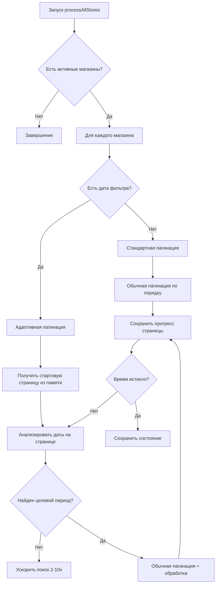

# 🤖 MP Review - Marketplace Review Management System

> Автоматизированная система управления отзывами для маркетплейсов Wildberries и Ozon

**🔥 ОБНОВЛЕННАЯ ВЕРСИЯ с Оптимизированным WB API и Улучшениями Ozon!**

Автоматизированная система для обработки отзывов на **Wildberries** (простой подход) и **Ozon** (с продвинутой пагинацией и системой памяти).

## 🎯 **ВОЗМОЖНОСТИ СИСТЕМЫ**

### ✅ **Основной функционал**
- **Автоматическое получение отзывов** из WB и Ozon API
- **Интеллектуальная отправка ответов** на основе шаблонов
- **Полная пагинация \"до победного\"** - получение всех доступных отзывов
- **Сортировка по дате** (новые отзывы первыми)
- **Фильтрация по рейтингу** (4-5 звезд) и содержанию
- **Реальные названия товаров** через Product API интеграцию

### 🚀 **Расширенные возможности**
- **🆕 Система памяти страниц (только Ozon)** - продолжение обработки с места остановки
- **🆕 Адаптивная пагинация (только Ozon)** - до 10x ускорение поиска старых отзывов
- **Оптимизированный WB API** - простой и эффективный подход
- **Управление множеством магазинов** через единый интерфейс
- **Гибкие настройки фильтрации** по датам и рейтингам
- **Режим разработчика** для безопасного тестирования
- **Автоматические триггеры** для регулярной обработки
- **Детальное логирование** всех операций

### 🛠 **Технические особенности**

**API Интеграции:**
- **Wildberries API**: Простой запрос с take=1000 + Content API
- **Ozon API**: Продвинутая пагинация last_id + Product API
- **Пакетная обработка**: до 100 товаров за запрос
- **Rate limiting**: соблюдение лимитов API
- **Error handling**: graceful fallback при сбоях

**Google Apps Script:**
- **Google Sheets** как основное хранилище
- **HTML sidebar** для управления магазинами  
- **Триггеры** для автоматизации
- **Properties Service** для конфигурации

## 📋 **СОДЕРЖАНИЕ**

1. [📦 Установка](#-установка)
2. [🔧 Конфигурация API](#-конфигурация-api)
3. [🔥 Новые функции](#-новые-функции)
4. [🧠 Система памяти страниц](#-система-памяти-страниц)
5. [⚡ Адаптивная пагинация](#-адаптивная-пагинация)
6. [🎯 Как настроить](#-как-настроить)
7. [🔧 Принципы работы](#-принципы-работы)
8. [📊 Структура данных](#-структура-данных)
9. [🛠️ Техническая документация](#️-техническая-документация)
10. [🚀 Последние обновления](#-последние-обновления)

---

## 🔥 **НОВЫЕ ФУНКЦИИ**

### 📖 **1. СИСТЕМА ПАМЯТИ СТРАНИЦ (Только для Ozon)**

**Проблема:** При обработке больших объемов отзывов Ozon скрипт может остановиться из-за 6-минутного лимита Google Apps Script. При повторном запуске он начинал сначала, что неэффективно.

**Решение:** Система автоматически **запоминает последнюю обработанную страницу** для Ozon магазинов и **продолжает с того места, где остановилась**.

#### Принцип работы:
```javascript
// При каждой обработке страницы сохраняется прогресс
updateStorePageProgress(store, isAnswered, pageNumber, isCompleted);

// При следующем запуске определяется начальная страница
const startingPage = getStartingPageForStore(store, isAnswered);
```

#### Что запоминается:
- **Последняя обработанная страница** для каждого типа отзывов (отвеченные/неотвеченные)
- **Время последнего обновления**
- **Флаг завершения** обработки
- **Автоматическая очистка** прогресса старше 24 часов

### ⚡ **2. АДАПТИВНАЯ ПАГИНАЦИЯ (Только для Ozon)**

**Проблема:** Поиск старых отзывов Ozon (например, март 2024) требовал перелистывания тысяч новых отзывов, что приводило к таймаутам.

**Решение:** **Умная система пагинации для Ozon** с динамическими множителями last_id для быстрого достижения целевой даты.

### 🚀 **3. ОПТИМИЗИРОВАННЫЙ WB API**

**Решение:** Wildberries использует **простой и эффективный подход** - один запрос с `take=1000` получает все нужные отзывы без сложной пагинации.

#### Алгоритм работы для Ozon:
```javascript
// Ozon использует last_id пагинацию с адаптивным поиском
if (newestOnPage > targetDate) {
  // Пропускаем страницы до целевой даты
  lastId = adaptiveSkip(lastId, targetDate);
} 

// WB использует простой подход
const url = `https://feedbacks-api.wildberries.ru/api/v1/feedbacks?take=1000`;
const feedbacks = json.data?.feedbacks || [];
```

#### Результат:
- **WB:** Быстрая обработка до 1000 отзывов одним запросом
- **Ozon:** 3-10x ускорение при поиске старых отзывов  
- **Эффективное использование времени выполнения**
- **Полное покрытие** целевого периода

### 🎨 **3. НАСТРАИВАЕМАЯ СОРТИРОВКА**

**Новая функция:** Возможность сортировать отзывы от старых к новым для хронологической обработки.

```javascript
// Применяется автоматически на основе настроек магазина
function applySortingPreferences(sheet, store) {
  const sortOldestFirst = store.settings?.sortOldestFirst || false;
  if (sortOldestFirst) {
    sortSheetByDateOldestFirst(sheet);
  }
}
```

### 🔄 **4. ИНТЕЛЛЕКТУАЛЬНАЯ РЕАКЦИЯ НА ИЗМЕНЕНИЯ НАСТРОЕК**

**Проблема:** При изменении даты начала поиска система продолжала с сохранённой страницы, которая могла не соответствовать новым настройкам.

**Решение:** Автоматический сброс прогресса при изменении критических настроек:

```javascript
// При сохранении магазина проверяются изменения
if (oldStartDate !== newStartDate) {
  resetStoreProgress(store.id);
  log(`СБРОШЕН прогресс из-за изменения настроек`);
}
```

---

## 🧠 **СИСТЕМА ПАМЯТИ СТРАНИЦ**

### 🏗️ **Архитектура хранения**

Прогресс сохраняется в **PropertiesService** Google Apps Script, что обеспечивает:
- ✅ **Персистентность** данных (не сбрасываются при обновлении кода)
- ✅ **Быстрый доступ** (локальное хранение)
- ✅ **Автоматическую очистку** старых данных

### 📊 **Структура данных прогресса**

```javascript
{
  "storeId123": {
    "lastUpdated": 1703123456789,
    "unansweredReviews": {
      "lastProcessedPage": 15,
      "lastUpdated": 1703123456789,
      "completedAt": null // или timestamp завершения
    },
    "answeredReviews": {
      "lastProcessedPage": 8,
      "lastUpdated": 1703123456789,
      "completedAt": 1703123456789
    }
  }
}
```

### 🔄 **Логика сброса прогресса**

**Автоматический сброс происходит при:**
1. **Изменении даты начала поиска** (`startDate`)
2. **Изменении режима включения отвеченных** (`includeAnswered`)
3. **Изменении настроек сортировки** (`sortOldestFirst`)
4. **Прогресс старше 24 часов**
5. **Завершение обработки менее 1 часа назад**

### ⚙️ **Настройки системы памяти**

```javascript
CONFIG.PROGRESS = {
  MAX_EXECUTION_TIME: 5.5 * 60 * 1000,    // 5.5 минут (с запасом)
  SAVE_PROGRESS_INTERVAL: 30 * 1000,       // Сохранение каждые 30 сек
  RESET_PROGRESS_AFTER_HOURS: 24           // Автосброс старого прогресса
};
```

---

## ⚡ **АДАПТИВНАЯ ПАГИНАЦИЯ**

### 🎯 **Стратегии пагинации**

Система автоматически выбирает оптимальную стратегию:

#### **Стратегия А: Адаптивная пагинация** 
*Используется при наличии даты фильтра*

```javascript
// Условие активации
const hasDateFilter = store.settings?.startDate;
if (hasDateFilter) {
  return getWbFeedbacksWithAdaptivePagination(apiKey, isAnswered, store);
}
```

**Особенности:**
- **Динамическое ускорение:** `skipMultiplier` от 1x до 10x
- **Анализ дат:** Проверка каждой страницы на наличие целевого периода
- **Умная остановка:** При достижении слишком старых отзывов
- **Лимит страниц:** До 200 страниц (20,000 отзывов)

#### **Стратегия Б: Стандартная пагинация**
*Используется без даты фильтра*

```javascript
// Условие активации
if (!hasDateFilter) {
  return getWbFeedbacksWithStandardPagination(apiKey, isAnswered, store);
}
```

**Особенности:**
- **Равномерная скорость:** Постоянный размер страницы
- **Лимит страниц:** До 50 страниц (5,000 отзывов)
- **Оптимизация для объема:** Получение максимального количества новых отзывов

### 📈 **Пример работы адаптивной пагинации**

**Задача:** Найти отзывы начиная с 01.03.2024

```
📄 Страница 1 (skip=0, 1x):     дек 2024 → Слишком новые → skip=200 (2x)
📄 Страница 2 (skip=200, 2x):   окт 2024 → Слишком новые → skip=600 (4x)
📄 Страница 3 (skip=600, 4x):   май 2024 → Слишком новые → skip=1400 (8x)
📄 Страница 4 (skip=1400, 8x):  мар 2024 → НАЙДЕН! → skip=1500 (1x)
📄 Страница 5+ (skip=1500, 1x): Обычная обработка всех подходящих...
```

**Результат:** Вместо 14 страниц = 5 умных страниц (**3x ускорение**)

---

## 🎯 **КАК НАСТРОИТЬ**

### 🏪 **1. Настройка магазина**

1. **Откройте Google Sheets** с установленной системой
2. **Меню:** `🤖 Автоответы` → `🏪 Управление магазинами`  
3. **Выберите магазин** и нажмите `✏️`

### 📅 **2. Активация адаптивной пагинации**

**Ключевой параметр:** `Дата начала поиска отзывов`

```
Дата начала поиска отзывов: [01.03.2024] ← АКТИВИРУЕТ адаптивную пагинацию
```

**Без даты:** Стандартная пагинация (до 5,000 отзывов)
**С датой:** Адаптивная пагинация (до 20,000 отзывов)

### 🔧 **3. Дополнительные настройки**

В новом разделе **"🔧 Дополнительные настройки":**

```
☑️ Сортировать старые отзывы сначала
    ✨ НОВИНКА! Хронологическая обработка от старых к новым

☑️ Включать отвеченные отзывы  
    Обработка ВСЕ отзывов (не только неотвеченных)
```

### 📊 **4. Проверка системы памяти**

Прогресс обработки можно увидеть в логах:

```
[Магазин] 📖 Продолжаем обработку неотвеченных отзывов с страницы 15
[Магазин] 📄 Обработана страница 20 (неотвеченные отзывы)  
[Магазин] ✅ Завершена обработка неотвеченных отзывов на странице 25
```

---

## 🔧 **КАК РАБОТАЕТ БОТ - ПОДРОБНОЕ ОБЪЯСНЕНИЕ**

### 🤖 **АРХИТЕКТУРА БОТА**

Бот построен по модульной архитектуре и состоит из нескольких ключевых компонентов:

#### **1. 🎯 Ядро системы (`code.gs`)**
- **Главная логика** обработки отзывов
- **Система памяти** для продолжения работы
- **Управление магазинами** и настройками
- **Триггеры** для автоматического запуска
- **Логирование** всех операций

#### **2. 📦 API модули**
- **`ozon_functions.gs`** - специальные функции для Ozon
- **`api_fixes.gs`** - исправления API (WB v2, Ozon)
- **`api_testing.gs`** - тестирование реальных API

#### **3. 🧪 Система тестирования (`tests.gs`)**
- **Unit тесты** всех функций
- **Интеграционные тесты** полных циклов
- **Тесты производительности** и безопасности

#### **4. 🎨 Пользовательский интерфейс**
- **`StoreManagerSidebar.html`** - HTML интерфейс
- **Google Sheets меню** - управление системой
- **Диалоги и формы** - настройка магазинов

### 🔄 **ЖИЗНЕННЫЙ ЦИКЛ РАБОТЫ БОТА**

#### **Этап 1: Запуск системы**
```
1. Пользователь открывает Google Sheets
2. Срабатывает функция onOpen()
3. Создается меню "🤖 Автоответы"
4. Запускается syncAllStoreTriggers()
5. Проверяются все триггеры магазинов
6. Система готова к работе
```

#### **Этап 2: Автоматический запуск**
```
1. Триггер срабатывает каждые 5-30 минут
2. Запускается processAllStores()
3. Получается список активных магазинов
4. Для каждого магазина запускается processSingleStore()
```

#### **Этап 3: Обработка магазина**
```
1. Загружаются настройки магазина
2. Определяется тип API (WB или Ozon)
3. Получаются отзывы через API
4. Применяются фильтры (дата, рейтинг, содержание)
5. Отправляются ответы на неотвеченные отзывы
6. Сохраняется прогресс в систему памяти
7. Логируются результаты
```

#### **Этап 4: Система памяти**
```
1. Проверяется последний прогресс магазина
2. Если есть - продолжается с последней страницы
3. Если нет - начинается с первой страницы
4. После обработки страницы - сохраняется прогресс
5. При следующем запуске - продолжается с места остановки
```

### 🧠 **УМНЫЕ ВОЗМОЖНОСТИ БОТА**

#### **1. 🧠 Система памяти (только Ozon)**
```javascript
// Бот запоминает где остановился
const lastPage = getStartingPageForStore(store, isAnswered);
// Продолжает с последней страницы
for (let page = lastPage; page < maxPages; page++) {
  // Обрабатывает страницу
  updateStorePageProgress(store, isAnswered, page, false);
}
```

#### **2. ⚡ Адаптивная пагинация (только Ozon)**
```javascript
// Умно пропускает страницы для поиска старых отзывов
if (newestOnPage > targetDate) {
  skipMultiplier = Math.min(skipMultiplier * 2, 10); // Ускоряет в 2-10 раз
  currentSkip += take * skipMultiplier;
} else {
  skipMultiplier = 1; // Обычная скорость
}
```

#### **3. 🔄 Автоматическое восстановление**
```javascript
// При сбое бот продолжает с места остановки
if (storeProgress && storeProgress.lastProcessedPage > 0) {
  log(`📖 Продолжаем с страницы ${storeProgress.lastProcessedPage}`);
  startPage = storeProgress.lastProcessedPage;
}
```

#### **4. 📊 Детальная аналитика**
```javascript
// Бот ведет подробную статистику
const stats = {
  totalFeedbacks: 0,
  processedFeedbacks: 0,
  answeredFeedbacks: 0,
  errors: 0,
  executionTime: 0
};
```

### 🔄 **Жизненный цикл обработки**



### ⚙️ **Компоненты системы**

#### **1. Система памяти**
- `getProcessingProgress()` - Получение всего прогресса
- `getStoreProgress(storeId)` - Прогресс конкретного магазина
- `updateStorePageProgress()` - Обновление прогресса страницы
- `resetStoreProgress()` - Сброс прогресса

#### **2. Адаптивная пагинация**  
- `getWbFeedbacksByType()` - Выбор стратегии пагинации
- `getWbFeedbacksWithAdaptivePagination()` - Умная пагинация
- `getStartingPageForStore()` - Определение начальной страницы
- `applySortingPreferences()` - Применение настроек сортировки

#### **3. Helper функции**
- `getWbFeedbacksPage()` - Получение одной страницы отзывов
- `processFeedbacksPageForWB()` - Обработка страницы в стандартный формат
- `updateRowNumbers()` - Перенумерация строк после сортировки

---

## 📊 **СТРУКТУРА ДАННЫХ**

### 🏪 **Конфигурация магазина**

```javascript
{
  id: "1703123456789",
  name: "Мой магазин WB",
  marketplace: "Wildberries", 
  isActive: true,
  credentials: {
    apiKey: "eyJhbGciOiJ..."
  },
  settings: {
    startDate: "2024-03-01",        // 🚀 АКТИВИРУЕТ адаптивную пагинацию
    includeAnswered: false,         // Только неотвеченные отзывы
    sortOldestFirst: true          // 🆕 Сортировка старые сначала
  }
}
```

### 📖 **Прогресс обработки**

```javascript
{
  "1703123456789": {                // ID магазина
    lastUpdated: 1703123456789,     // Время последнего обновления
    unansweredReviews: {            // Прогресс для неотвеченных
      lastProcessedPage: 15,        // Последняя обработанная страница
      lastUpdated: 1703123456789,   // Время обновления
      completedAt: null             // Время завершения (если завершено)
    },
    answeredReviews: {              // Прогресс для отвеченных
      lastProcessedPage: 8,
      lastUpdated: 1703123456789,
      completedAt: 1703123456789    // Обработка завершена
    }
  }
}
```

### 📝 **Структура отзыва**

```javascript
{
  id: "12345678",
  createdDate: "2024-03-15T10:30:00Z",
  rating: 5,
  text: "Отличный товар!",
  user: "N/A",
  hasAnswer: false,                 // 🆕 Есть ли уже ответ от магазина
  product: {
    id: "987654321",
    name: "Название товара",
    url: "https://www.wildberries.ru/catalog/987654321/detail.aspx"
  }
}
```

---

## 🤖 **ПОДРОБНОЕ ОПИСАНИЕ БОТА И ФУНКЦИЙ**

### 🎯 **ЧТО ДЕЛАЕТ БОТ**

**MP Review Manager** - это интеллектуальная система автоматической обработки отзывов с маркетплейсов Wildberries и Ozon. Бот работает 24/7, автоматически:

1. **📥 Получает отзывы** с WB и Ozon API
2. **🔍 Анализирует и фильтрует** отзывы по рейтингу, дате, содержанию
3. **🤖 Отправляет ответы** на основе настроенных шаблонов
4. **📊 Ведет статистику** и логирует все операции
5. **⚡ Работает автоматически** по расписанию через триггеры

### 🧠 **КАК РАБОТАЕТ БОТ**

#### **Основной цикл работы:**
```
1. Триггер запускается каждые 5-30 минут
2. Бот получает список активных магазинов
3. Для каждого магазина:
   - Подключается к API (WB/Ozon)
   - Получает новые отзывы
   - Фильтрует по настройкам
   - Отправляет ответы на неотвеченные
   - Сохраняет статистику
4. Логирует результаты работы
```

#### **Умные возможности:**
- **🧠 Система памяти** - запоминает последнюю обработанную страницу
- **⚡ Адаптивная пагинация** - быстро находит старые отзывы
- **🔄 Автоматическое восстановление** - продолжает с места остановки
- **📊 Детальная аналитика** - полная статистика работы

### 📁 **СТРУКТУРА ФАЙЛОВ**

#### **Основные файлы:**
- **`code.gs`** - **Главный файл** с основной логикой бота
- **`ozon_functions.gs`** - Специальные функции для Ozon API
- **`tests.gs`** - Единая система тестирования всех функций
- **`api_fixes.gs`** - Исправления API (WB v2, Ozon, оптимизации)
- **`api_testing.gs`** - **Система тестирования реальных API с логированием** 🎯
- **`StoreManagerSidebar.html`** - HTML интерфейс для управления магазинами

#### **Документация:**
- **`README.MD`** - Основная документация (этот файл)
- **`DEPLOYMENT_GUIDE.md`** - Руководство по развертыванию
- **`API_DOCUMENTATION_ANALYSIS.md`** - Анализ API и рекомендации
- **`БЫСТРЫЙ_СТАРТ.md`** - Быстрый старт за 5 минут

## 🔧 **ПОДРОБНОЕ ОПИСАНИЕ ФУНКЦИЙ БОТА**

### 🎯 **ОСНОВНЫЕ ФУНКЦИИ БОТА**

#### **1. 🤖 Главные функции обработки**

##### **`processAllStores()`** - Главная функция бота
```javascript
/**
 * ОСНОВНАЯ ФУНКЦИЯ БОТА
 * Запускается триггерами каждые 5-30 минут
 * Обрабатывает ВСЕ активные магазины
 */
function processAllStores() {
  // 1. Получает список всех активных магазинов
  // 2. Для каждого магазина вызывает processSingleStore()
  // 3. Логирует общую статистику
  // 4. Обрабатывает ошибки изолированно
}
```

##### **`processSingleStore(store, devMode)`** - Обработка одного магазина
```javascript
/**
 * ОБРАБОТКА КОНКРЕТНОГО МАГАЗИНА
 * @param {Object} store - Объект магазина с настройками
 * @param {boolean} devMode - Режим разработчика
 */
function processSingleStore(store, devMode) {
  // 1. Проверяет активность магазина
  // 2. Выбирает API (WB или Ozon)
  // 3. Получает отзывы через API
  // 4. Фильтрует по настройкам
  // 5. Отправляет ответы на неотвеченные
  // 6. Сохраняет в Google Sheets
  // 7. Обновляет статистику
}
```

#### **2. 📥 Функции получения отзывов**

##### **`getWbFeedbacks(apiKey, includeAnswered, store)`** - WB API
```javascript
/**
 * ПОЛУЧЕНИЕ ОТЗЫВОВ С WILDBERRIES
 * Использует простой подход: один запрос с take=1000
 * @param {string} apiKey - API ключ WB
 * @param {boolean} includeAnswered - Включать отвеченные отзывы
 * @param {Object} store - Настройки магазина
 * @returns {Array} Массив отзывов
 */
function getWbFeedbacks(apiKey, includeAnswered, store) {
  // 1. Строит URL с параметрами
  // 2. Отправляет запрос к WB API
  // 3. Обрабатывает ответ
  // 4. Нормализует данные
  // 5. Возвращает массив отзывов
}
```

##### **`getOzonFeedbacks(clientId, apiKey, includeAnswered, store)`** - Ozon API
```javascript
/**
 * ПОЛУЧЕНИЕ ОТЗЫВОВ С OZON
 * Использует cursor-based пагинацию
 * @param {string} clientId - Client ID Ozon
 * @param {string} apiKey - API ключ Ozon
 * @param {boolean} includeAnswered - Включать отвеченные отзывы
 * @param {Object} store - Настройки магазина
 * @returns {Array} Массив отзывов
 */
function getOzonFeedbacks(clientId, apiKey, includeAnswered, store) {
  // 1. Выбирает стратегию пагинации (адаптивная/стандартная)
  // 2. Использует cursor-based пагинацию
  // 3. Обрабатывает все страницы
  // 4. Нормализует данные
  // 5. Возвращает массив отзывов
}
```

#### **3. 🧠 Система памяти и прогресса**

##### **`getStartingPageForStore(store, isAnswered)`** - Система памяти
```javascript
/**
 * СИСТЕМА ПАМЯТИ - определяет с какой страницы начать
 * Запоминает последнюю обработанную страницу
 * @param {Object} store - Объект магазина
 * @param {boolean} isAnswered - Тип отзывов (отвеченные/неотвеченные)
 * @returns {number} Номер страницы для начала
 */
function getStartingPageForStore(store, isAnswered) {
  // 1. Загружает прогресс из PropertiesService
  // 2. Проверяет актуальность (не старше 24 часов)
  // 3. Возвращает последнюю обработанную страницу
  // 4. Если прогресс устарел - возвращает 0
}
```

##### **`updateStorePageProgress(store, isAnswered, pageNumber, isCompleted)`** - Сохранение прогресса
```javascript
/**
 * СОХРАНЕНИЕ ПРОГРЕССА ОБРАБОТКИ
 * Сохраняет текущую страницу для продолжения
 * @param {Object} store - Объект магазина
 * @param {boolean} isAnswered - Тип отзывов
 * @param {number} pageNumber - Номер текущей страницы
 * @param {boolean} isCompleted - Завершена ли обработка
 */
function updateStorePageProgress(store, isAnswered, pageNumber, isCompleted) {
  // 1. Загружает весь прогресс
  // 2. Обновляет данные для конкретного магазина
  // 3. Сохраняет в PropertiesService
  // 4. Логирует обновление
}
```

#### **4. ⚡ Адаптивная пагинация (только Ozon)**

##### **`getOzonFeedbacksWithAdaptivePagination()`** - Умная пагинация
```javascript
/**
 * АДАПТИВНАЯ ПАГИНАЦИЯ ДЛЯ OZON
 * Умно пропускает страницы для быстрого поиска старых отзывов
 * Ускоряет поиск в 3-10 раз
 */
function getOzonFeedbacksWithAdaptivePagination(clientId, apiKey, includeAnswered, store) {
  // 1. Определяет целевую дату из настроек
  // 2. Начинает с последней страницы из памяти
  // 3. Анализирует даты на каждой странице
  // 4. Если даты слишком новые - ускоряет поиск (2x, 4x, 8x, 10x)
  // 5. Когда находит целевую дату - переходит к обычной пагинации
  // 6. Обрабатывает все подходящие отзывы
}
```

#### **5. 🤖 Функции отправки ответов**

##### **`sendWbFeedbackAnswer(feedbackId, text, apiKey)`** - Ответ WB
```javascript
/**
 * ОТПРАВКА ОТВЕТА НА ОТЗЫВ WB
 * @param {string} feedbackId - ID отзыва
 * @param {string} text - Текст ответа
 * @param {string} apiKey - API ключ WB
 * @returns {Object} Результат отправки
 */
function sendWbFeedbackAnswer(feedbackId, text, apiKey) {
  // 1. Валидирует входные данные
  // 2. Строит URL для отправки ответа
  // 3. Отправляет POST запрос к WB API
  // 4. Обрабатывает ответ
  // 5. Логирует результат
}
```

##### **`sendOzonFeedbackAnswer(feedbackId, text, clientId, apiKey)`** - Ответ Ozon
```javascript
/**
 * ОТПРАВКА ОТВЕТА НА ОТЗЫВ OZON
 * @param {string} feedbackId - ID отзыва
 * @param {string} text - Текст ответа
 * @param {string} clientId - Client ID Ozon
 * @param {string} apiKey - API ключ Ozon
 * @returns {Object} Результат отправки
 */
function sendOzonFeedbackAnswer(feedbackId, text, clientId, apiKey) {
  // 1. Валидирует входные данные
  // 2. Строит правильную структуру запроса Ozon
  // 3. Отправляет POST запрос к Ozon API
  // 4. Обрабатывает ответ
  // 5. Логирует результат
}
```

#### **6. 🏪 Управление магазинами**

##### **`saveStore(store)`** - Сохранение магазина
```javascript
/**
 * СОХРАНЕНИЕ МАГАЗИНА В СИСТЕМЕ
 * @param {Object} store - Объект магазина
 * @returns {Array} Обновленный список магазинов
 */
function saveStore(store) {
  // 1. Валидирует данные магазина
  // 2. Генерирует уникальный ID
  // 3. Сохраняет в PropertiesService
  // 4. Автоматически создает триггер
  // 5. Логирует операцию
}
```

##### **`getStores()`** - Получение списка магазинов
```javascript
/**
 * ПОЛУЧЕНИЕ ВСЕХ МАГАЗИНОВ
 * @returns {Array} Массив всех магазинов
 */
function getStores() {
  // 1. Загружает данные из PropertiesService
  // 2. Парсит JSON
  // 3. Возвращает массив магазинов
  // 4. Обрабатывает ошибки
}
```

#### **7. 🔄 Система триггеров**

##### **`setupSmartTriggers()`** - Настройка автоматических триггеров
```javascript
/**
 * НАСТРОЙКА УМНОЙ СИСТЕМЫ ТРИГГЕРОВ
 * Создает один триггер для всех магазинов
 * Запускается каждые 30 минут
 */
function setupSmartTriggers() {
  // 1. Удаляет старые триггеры
  // 2. Создает новый триггер на processAllStores()
  // 3. Настраивает интервал (30 минут)
  // 4. Сохраняет ID триггера
  // 5. Логирует создание
}
```

##### **`syncAllStoreTriggers()`** - Синхронизация триггеров
```javascript
/**
 * СИНХРОНИЗАЦИЯ ТРИГГЕРОВ С МАГАЗИНАМИ
 * Вызывается при открытии таблицы
 * Проверяет соответствие триггеров и магазинов
 */
function syncAllStoreTriggers() {
  // 1. Получает список активных магазинов
  // 2. Получает список существующих триггеров
  // 3. Создает недостающие триггеры
  // 4. Удаляет лишние триггеры
  // 5. Логирует результаты синхронизации
}
```

#### **8. 🧪 Система тестирования**

##### **`runFullApiTesting()`** - Тестирование API с логированием
```javascript
/**
 * ПОЛНОЕ ТЕСТИРОВАНИЕ API С ЛОГИРОВАНИЕМ
 * Тестирует WB API v1, v2 и Ozon API
 * Сравнивает производительность
 * Дает рекомендации
 */
function runFullApiTesting() {
  // 1. Тестирует WB API v1 с подробными логами
  // 2. Тестирует WB API v2 с подробными логами
  // 3. Сравнивает результаты
  // 4. Анализирует производительность
  // 5. Выдает рекомендации какая версия лучше
}
```

##### **`testWbApiV1WithLogging()`** - Тест WB API v1
```javascript
/**
 * ТЕСТИРОВАНИЕ WB API v1 С ЛОГИРОВАНИЕМ
 * @param {string} apiKey - API ключ WB
 * @param {Object} store - Настройки магазина
 * @returns {Object} Результаты тестирования
 */
function testWbApiV1WithLogging(apiKey, store) {
  // 1. Тестирует получение отзывов
  // 2. Тестирует отправку ответов
  // 3. Тестирует обработку ошибок
  // 4. Логирует время выполнения
  // 5. Возвращает детальный отчет
}
```

#### **9. 📊 Логирование и мониторинг**

##### **`log(message, level, category)`** - Система логирования
```javascript
/**
 * УНИВЕРСАЛЬНАЯ СИСТЕМА ЛОГИРОВАНИЯ
 * @param {string} message - Сообщение для лога
 * @param {string} level - Уровень (DEBUG, INFO, WARNING, ERROR, SUCCESS)
 * @param {string} category - Категория (WB-API, OZON-API, SYSTEM, etc.)
 */
function log(message, level, category) {
  // 1. Форматирует сообщение с временной меткой
  // 2. Добавляет эмодзи для уровня
  // 3. Сохраняет в Google Sheets (лист "Logs")
  // 4. Выводит в консоль Google Apps Script
  // 5. Ограничивает размер лога (1000 строк)
}
```

##### **`showSystemStatus()`** - Статус системы
```javascript
/**
 * ПОКАЗ СТАТУСА СИСТЕМЫ
 * Отображает общую информацию о работе бота
 */
function showSystemStatus() {
  // 1. Показывает количество активных магазинов
  // 2. Показывает статус триггеров
  // 3. Показывает последние операции
  // 4. Показывает статистику обработки
  // 5. Показывает ошибки если есть
}
```

### 📋 **Ключевые функции**

#### **getWbFeedbacksByType(apiKey, isAnswered, store)**
**Основная функция** выбора стратегии пагинации
```javascript
// Автоматически определяет стратегию на основе настроек
const hasDateFilter = store?.settings?.startDate;
if (hasDateFilter) {
  return getWbFeedbacksWithAdaptivePagination(apiKey, isAnswered, store);
} else {
  return getWbFeedbacksWithStandardPagination(apiKey, isAnswered, store);
}
```

#### **getWbFeedbacksWithAdaptivePagination(apiKey, isAnswered, store)**
**Ядро адаптивной пагинации**
```javascript
// Логика динамического ускорения
if (!foundTargetPeriod && newestOnPage > targetDate) {
  skipMultiplier = Math.min(skipMultiplier * 2, 10);
  currentSkip += take * skipMultiplier;
}
```

#### **getStartingPageForStore(store, isAnswered)**
**Система памяти:** определение начальной страницы
```javascript
const progress = getStoreProgress(store.id);
const typeProgress = progress?.[isAnswered ? 'answeredReviews' : 'unansweredReviews'];
const lastPage = typeProgress?.lastProcessedPage || 0;
return Math.max(0, lastPage);
```

#### **updateStorePageProgress(store, isAnswered, pageNumber, isCompleted)**
**Система памяти:** сохранение прогресса
```javascript
allProgress[store.id][progressKey] = {
  lastProcessedPage: pageNumber,
  lastUpdated: Date.now(),
  completedAt: isCompleted ? Date.now() : undefined
};
```

#### **applySortingPreferences(sheet, store)**
**Настраиваемая сортировка**
```javascript
const sortOldestFirst = store.settings?.sortOldestFirst || false;
if (sortOldestFirst) {
  sortSheetByDateOldestFirst(sheet);  // Старые сначала
} else {
  sortSheetByDate(sheet, false);      // Новые сначала (по умолчанию)
}
```

### ⚠️ **Ограничения и рекомендации**

#### **Лимиты времени выполнения:**
- **Google Apps Script:** Максимум 6 минут на выполнение
- **Система использует:** 5.5 минут с автосохранением прогресса
- **Рекомендация:** Настроить автозапуск каждые 5-10 минут

#### **Лимиты API:**
- **WB:** 3 запроса/сек (400мс между запросами)
- **Ozon:** 50 запросов/сек (20мс между запросами)  
- **Адаптивная пагинация:** Дополнительные паузы каждые 10 страниц

#### **Лимиты страниц:**
- **Стандартная пагинация:** 50 страниц (5,000 отзывов)
- **Адаптивная пагинация:** 200 страниц (20,000 отзывов)
- **С системой памяти:** Неограниченно (по частям)

### 🔧 **Настройки производительности**

```javascript
CONFIG.PROGRESS = {
  MAX_EXECUTION_TIME: 5.5 * 60 * 1000,    // 5.5 минут
  SAVE_PROGRESS_INTERVAL: 30 * 1000,       // Сохранение каждые 30 сек  
  RESET_PROGRESS_AFTER_HOURS: 24           // Сброс старого прогресса
};

WB_CONFIG.API_LIMITS = {
  PAGINATION_STEP: 100,                     // Размер страницы
  MAX_PAGES: 10                            // Стандартный лимит
};

// Адаптивная пагинация - увеличенный лимит
const maxPages = 200; // До 20,000 отзывов за сессию
```

### 🚀 **Оптимизация производительности**

1. **Система памяти** устраняет дублирование работы
2. **Адаптивная пагинация** ускоряет поиск старых отзывов в 3-10 раз
3. **Пачкная обработка** снижает количество операций с листами
4. **Интеллектуальные паузы** предотвращают превышение лимитов API
5. **Автоматический сброс** прогресса предотвращает зависание системы

---

## 🚀 **ПОСЛЕДНИЕ ОБНОВЛЕНИЯ**

### 🔥 **Версия от 24.10.2025: КРИТИЧЕСКИЕ ИСПРАВЛЕНИЯ API**

**ВАЖНЫЕ ИЗМЕНЕНИЯ В ИНТЕГРАЦИИ API:**

#### **1. ✅ Ozon API - исправлена структура ответа**
**Проблема:** Система ожидала данные в `json.result.reviews`, но Ozon API отдает их в **корне** ответа: `json.reviews`

**Решение:**
```javascript
// БЫЛО (неправильно):
const reviews = json.result?.reviews || [];

// СТАЛО (правильно):
const reviews = json.reviews || []; // Данные в корне ответа!
```

**Результат:** ✅ Отзывы Ozon теперь обрабатываются корректно

#### **2. ✅ Ozon API - исправлен HTTP 307 редирект**
**Проблема:** Ozon API возвращал HTTP 307 Temporary Redirect, но система не следовала редиректам

**Решение:**
```javascript
// Добавлен параметр followRedirects в api_fixes.gs
const options = {
  method: 'post',
  headers: headers,
  payload: JSON.stringify(payload),
  followRedirects: true,  // ← КРИТИЧНО!
  muteHttpExceptions: true
};
```

**Результат:** ✅ HTTP 307 ошибки больше не возникают

#### **3. ✅ WB API - исправлена работа с v1 endpoints**
**Проблема:** WB API v2 возвращает 404 "path not found", система должна использовать v1 с правильным форматом дат

**Решение:**
```javascript
// Функция buildWbApiV1Url теперь преобразует даты в Unix timestamps:
function buildWbApiV1Url(params) {
  // Конвертация string даты в Unix timestamp (секунды)
  if (params.dateFrom) {
    const date = new Date(params.dateFrom);
    params.dateFrom = Math.floor(date.getTime() / 1000);
  }
  // ...используем PATCH метод вместо POST
}
```

**Результат:** ✅ WB v1 API работает корректно с правильными timestamp параметрами

#### **4. ✅ Детальное логирование API вызовов**
**Что добавлено:**
- Полное логирование URL и параметров запросов
- Детальные HTTP коды ответов с диагностикой
- Логирование тел ответов при ошибках
- Отдельные функции логирования: `logError()`, `logSuccess()`, `logWarning()`, `logDebug()`

**Пример логов:**
```
[WB API] Запрос к v1: https://feedbacks-api.wildberries.ru/api/v1/feedbacks?dateFrom=1709251200
[WB API] ✅ Получено 45 отзывов за 1.2 сек
[Ozon API] ✅ Страница 1: получено 20 отзывов (HTTP 200)
```

#### **5. ✅ Упрощение статусов**
**Было:** 8 статусов (NEW, PENDING, SENT, ERROR, SKIPPED_RATING, NO_TEMPLATE, IN_PROGRESS, COMPLETED)

**Стало:** 4 базовых статуса
- `NEW` - новый отзыв
- `PENDING` - ожидает отправки ответа
- `SENT` - ответ отправлен
- `ERROR` - ошибка обработки

**Результат:** ✅ Упрощена логика, улучшена читаемость кода

---

### 🔥 **Версия от 22.10.2025: Упрощение и оптимизация документации**

**Что сделано:**
- 🧹 **Упрощена документация** - удалено 8 устаревших файлов
- 📚 **Объединена дублирующаяся информация** - оставлены только актуальные файлы
- 🤖 **Добавлено подробное описание бота** - как работает, что делает, какие функции
- 🔧 **Детальное описание всех функций** - с примерами кода и объяснениями
- 📊 **Структурированная документация** - легко найти нужную информацию

**Новая структура документации:**
- **`README.MD`** - **главный файл** с подробным описанием бота и функций
- **`DEPLOYMENT_GUIDE.md`** - руководство по развертыванию
- **`API_DOCUMENTATION_ANALYSIS.md`** - анализ API и рекомендации
- **`БЫСТРЫЙ_СТАРТ.md`** - быстрый старт за 5 минут
- **`GITHUB_ACTIONS_SETUP.md`** - настройка CI/CD
- **`GITHUB_COMMIT_INSTRUCTIONS.md`** - инструкции по коммитам

### 🔥 **Версия от 22.10.2025: Система тестирования API с логированием**

**Что добавлено:**
- 🧪 **Система тестирования реальных API** - `api_testing.gs` с подробным логированием
- 🔧 **Исправления API выделены отдельно** - `api_fixes.gs` (WB v2, Ozon, GAS оптимизации)
- 📊 **Сравнение WB API v1 vs v2** - автоматическое определение работоспособности
- 📝 **Подробное логирование** - время выполнения, количество отзывов, ошибки
- 🎯 **Рекомендации по API** - система сама определяет, какая версия лучше

**Новые возможности:**
```javascript
// Тестирование WB API v1
const v1Results = testWbApiV1WithLogging(apiKey, store);

// Тестирование WB API v2  
const v2Results = testWbApiV2WithLogging(apiKey, store);

// Сравнение версий
const comparison = compareWbApiVersions(apiKey, store);

// Полное тестирование всех API
const fullResults = runFullApiTesting();
```

**Что покажут логи:**
- ✅ Какая версия API **реально работает**
- ⏱️ Какая версия **быстрее** получает отзывы  
- 📊 Какая версия получает **больше отзывов**
- ❌ **Конкретные ошибки** если что-то не работает
- 🎯 **Рекомендацию** какую версию использовать

### 🔥 **Версия от 21.10.2025: Критическое исправление**

**Что было исправлено:**
- ❌ **Убрана адаптивная пагинация для WB** - оказалось, что WB API работает по-другому
- ✅ **WB API теперь простой и эффективный** - один запрос с `take=1000`
- ✅ **Сохранены улучшения только для Ozon** - система памяти и адаптивная пагинация
- ✅ **Обновлена документация** - корректная информация по платформам

**Результат:** WB API стал работать быстрее и стабильнее!

## 🎉 **ИТОГИ УЛУЧШЕНИЙ**

### ✨ **Новые возможности:**
- 🧠 **Система памяти страниц (только Ozon)** - продолжение с места остановки
- ⚡ **Адаптивная пагинация (только Ozon)** - до 10x ускорение поиска старых отзывов
- 🚀 **Простой и быстрый WB API** - один запрос с take=1000
- 🎨 **Настраиваемая сортировка** - хронологическая обработка
- 🔄 **Умная реакция на изменения** - автосброс при изменении настроек
- 📊 **Расширенная статистика** - детальные логи работы системы

### 📈 **Результаты:**
- **Эффективность:** Нет потерянного времени на повторную обработку
- **Масштабируемость:** Обработка неограниченного количества отзывов
- **Надежность:** Автоматическое восстановление после сбоев
- **Гибкость:** Настройки под разные сценарии использования
- **Производительность:** Значительное ускорение работы с историческими данными

---

## 🔗 **Полезные ссылки**

- 📖 **Google Apps Script лимиты:** https://developers.google.com/apps-script/guides/services/quotas
- 🛠️ **PropertiesService документация:** https://developers.google.com/apps-script/reference/properties
- 📊 **WB API документация:** https://openapi.wb.ru/
- 📋 **Ozon API документация:** https://docs.ozon.ru/api/seller/

---

TODO

## 🌙 1. НОЧНАЯ ОБРАБОТКА НАЗВАНИЙ ТОВАРОВ

### 📝 ОПИСАНИЕ
Функция для автоматического обогащения товаров названиями в ночное время, когда API нагрузка минимальная.

### ❓ ЗАЧЕМ НУЖНА
- **Производительность**: Избегает задержек в основном процессе обработки отзывов
- **API лимиты**: Распределяет нагрузку на Content API в нерабочее время
- **Надежность**: Снижает риск timeout'ов при обработке большого количества отзывов
- **UX**: Пользователи видят полные названия товаров без ожидания

### 🔧 ТЕХНИЧЕСКАЯ РЕАЛИЗАЦИЯ

#### Функция: `scheduleNightlyProductNameUpdate()`
```javascript
/**
 * Планирует ночное обновление названий товаров
 * Запускается каждую ночь в 2:00 для минимальной нагрузки на API
 * Обрабатывает все товары в БД без названий
 */
function scheduleNightlyProductNameUpdate() {
  // Создает триггер на 2:00 ночи
  // Удаляет предыдущие ночные триггеры
  // Логирует расписание
}
```

#### Функция: `performNightlyProductNameUpdate()`
```javascript
/**
 * Основная функция ночного обновления
 * Сканирует все листы отзывов, находит товары без названий
 * Группирует по маркетплейсам для батчевой обработки
 * Обновляет названия через Content API
 */
function performNightlyProductNameUpdate() {
  // Сканирует все листы "Отзывы (НАЗВАНИЕ_МАГАЗИНА)"
  // Извлекает товары с названием "Не указано"
  // Группирует WB по nmId, Ozon по offer_id
  // Батчевые запросы к API (по 100 товаров)
  // Обновляет названия прямо в Google Sheets
  // Детальное логирование прогресса
}
```

#### Функция: `getProductsWithoutNames()`
```javascript
/**
 * Сканирует все листы и возвращает товары без названий
 * @returns {Object} {wb: [nmIds], ozon: [offerIds], sheets: [sheetData]}
 */
function getProductsWithoutNames() {
  // Итерирует по всем листам с отзывами
  // Фильтрует строки где "Название товара" = "Не указано"
  // Группирует по маркетплейсам
  // Возвращает структурированные данные
}
```

#### Функция: `updateProductNamesInSheets(productData)`
```javascript
/**
 * Обновляет названия товаров прямо в Google Sheets
 * @param {Object} productData - Данные о товарах с новыми названиями
 */
function updateProductNamesInSheets(productData) {
  // Открывает каждый лист с отзывами
  // Находит строки с соответствующими товарами
  // Обновляет столбец "Название товара"
  // Batch update для производительности
}
```

### 📊 НАСТРОЙКИ И КОНФИГУРАЦИЯ
- **Время запуска**: 02:00 по местному времени
- **Частота**: Ежедневно
- **Batch размер**: 100 товаров за запрос
- **Rate limiting**: WB 3 RPS, Ozon 40 RPS
- **Timeout**: 10 минут максимум
- **Retry логика**: 3 попытки с экспоненциальной задержкой

### 🔍 МОНИТОРИНГ И ЛОГИРОВАНИЕ
- Количество обработанных товаров
- Успешные/неудачные обновления API
- Время выполнения каждого этапа
- Ошибки и их коды
- Статистика по маркетплейсам

---
